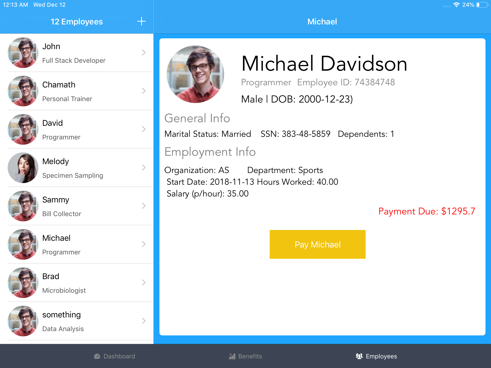
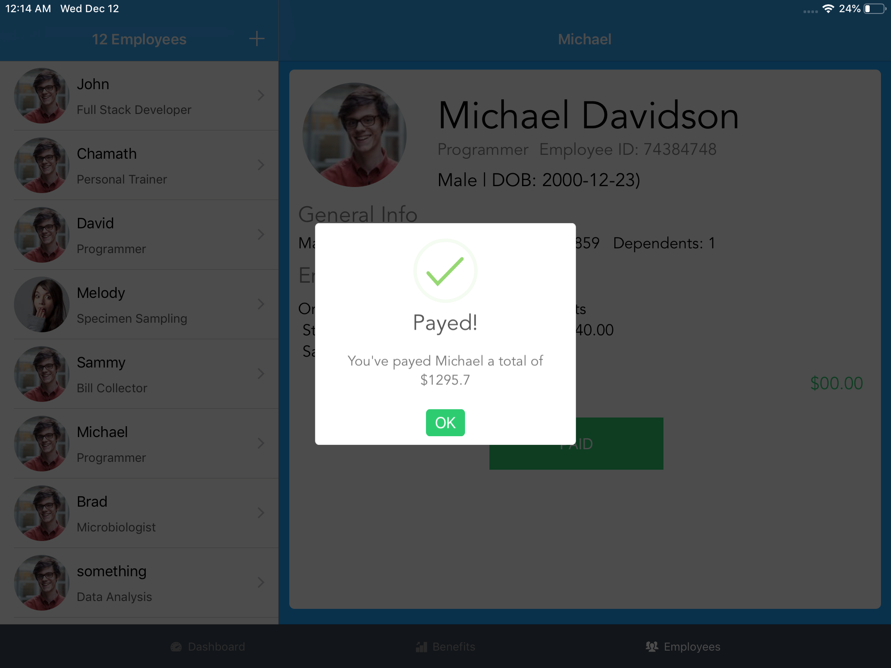

# HR-Easy Mobile payroll app  (Software Engineering CSC 430)

This app is an extension to the web application we've designed and developed in CSC 430 Software Engineering at the College of Staten Island.

## Overview:
As part of our midterm and final project in  our senior level course in Software Engineering, with a team of five developers, we've managed to build a 
large scale payroll program in a form of a web app that uses a backend to process, store, edit, delete and update user information.  This information is used
to calculate medical benefits, tax deductions, and other things to compute employee payroll based on the specifications defined earlier in the semester.

The final output in the web app is generating a paycheck for the employee with all the calculations complete and only yielding the final salary.
As part of a team of developers, using my skills in iOS development, I took the opportunity to create a lightweight mobile version of the web app to 
facilitate in the paying of employees in an easy to use interface that allows HR staff to pay individual employees based on data fetched off the server (if employee was paid or not).

The app was designed using Storyboards due to the time constraint of using a  programmatic approach. The app relies in a REST API written in PHP to talk to the database and fetch data off the server to then serve it via JSON objects. These JSON objects then are converted to notable swift objects which are then used on the UITableView.

Sample user to be paid
 

Sample user paid

## Item

#### Item
